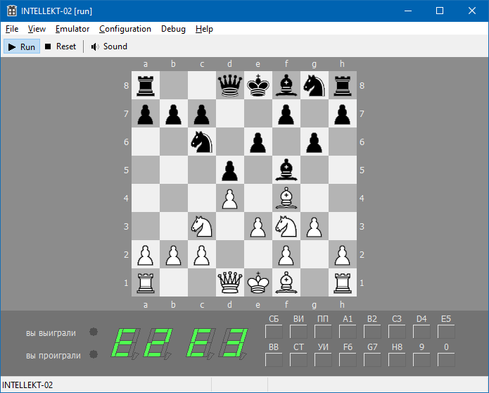

# intellekt02 - emulator of soviet chess computer

"ИНТЕЛЛЕКТ-02" is a small Soviet computer with chessboard-like case and games on cartridges.
Currently two ROM images restored, both for the Chess game, both supported in the emulator.

## Links

 - [Intellect 02 - Soviet Digital Electronics Museum](http://www.leningrad.su/museum/show_calc.php?n=328) 
 - [i8080-core](https://github.com/begoon/i8080-core) — the core used to emulate КР580ВМ80А microprocessor
 - [Кассета с шахматами для шахматного компьютера "Интеллект-02"](http://zx-pk.ru/threads/9276-skhemy-i-dokumentatsiya-na-otechestvennye-kompyutery-i-komplektuyushchie.html?p=864440&viewfull=1#post864440) — source of ROM image file, photos and cartridge docs
 - [Интеллект-02 - Emuverse.ru](http://www.emuverse.ru/wiki/%D0%98%D0%BD%D1%82%D0%B5%D0%BB%D0%BB%D0%B5%D0%BA%D1%82-02) — technical findings
 - http://hiarcs.net/forums/viewtopic.php?t=8825 — discussion on the emulator, in English
